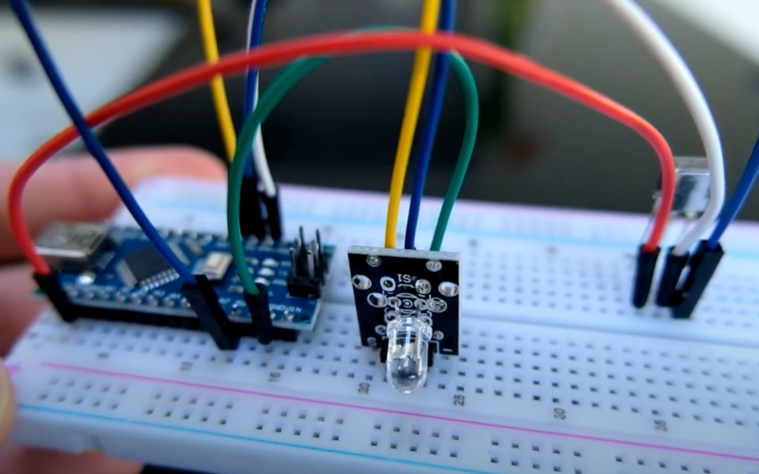
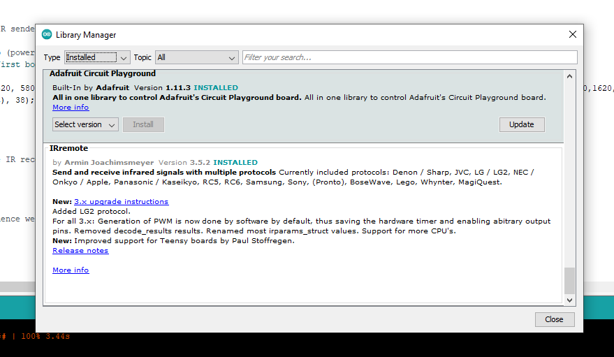
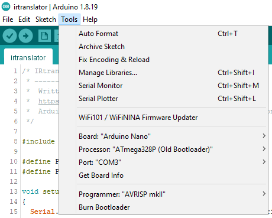
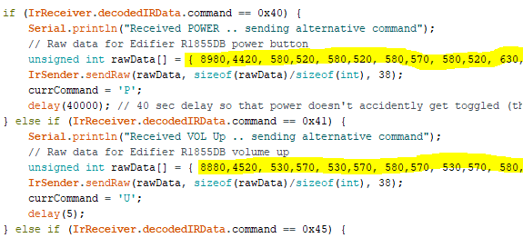

# IRtranslator
__Arduino IR Code Translator__ - Converts incoming IR codes from one manufacturer to another. You can use the Arduino source code to define the inbound IR codes you want to capture & have another IR code sent out. This lets you translate from one manufacturer to another.

This project came about when the Amazon Fire TV equipment control feature didn't have my model of speakers (Edifier R1855DB or R1850DB) in their list. None of the other models worked, and I didn't hold out much hope at having the them added by Amazon, especially when Edifier support said *"Our remotes use custom IR codes that can not be inputted into a universal remote"*. And, *"information about the IR code is not open to the public"* -- **challenge accepted!!**

# Video of the Project

# Part List

There's not much to this project.. you can substitute the KY-005 with an IR LED and NPN transistor if you like.

1. Arduino (most will be fine.. I'm using a Nano)
2. IR receiver/photodiode
3. IR transmitter (KY-005)
4. Wires & breadboard

# Wiring Diagram

Here's how to wire the components up.. it looks more complicated than it is! There's probably a better way to lay this out?

Here's how mine looks on a breadboard. You can see how I've ignored my own wiring diagram so that I use less wires ;) After I finished prototyping, I put the IR transmitter and receiver on longer cables to place them more neatly next to the equipment.

# Arduino IDE Setup

## IRRemote Library

After setting up the components as per the wiring diagram above, open up the Arduino IDE and make sure you've installed the 'IRremote' library;

 

Note: I'm using version 3.5 of the IRremote library, and v4 isn't compatible with the code I've written. 

## Board Settings

Then select your Arduino board type and the correct port when it's attached to your PC via USB. Mine looks like this;

 

## Upload the Sourcecode

Now you can upload the code (in src/irtranslator) into the Arduino using the Arduino IDE. Keep it attached to the PC so that you can look in the Serial Monitor to copy down the codes that get sent into the IR receviver.

# Capturing the IR Codes

You'll need to decide what your source and target brands will be, and what buttons you want to translate. In my case, I chose to have the Fire TV remote transmit codes for an Amazon Basics Soundbar. I'll then need to send out IR codes for an Edifier R1855DB/R1850DB.

Go through the buttons you want to capture and note them down (you're best copying both lines.. the one with the shorter code, and the full RAW data);

 

## Edit the Sourcecode for the Inbound IR Codes

Once you have those inbound IR codes (and you chose not to use the Amazon Basics Soundbar), edit the Arduino code in the highlighted areas;

 

## Edit the Sourcecode for the Outbound IR Codes

Then take the second remote (in my case, the Edifier R1855DB speaker remote) and note down the IR codes for that. This is the bit which might require the most effort on your part.. I used a load of time trying to get the right format which would be correctly transmitted.

The RAW codes worked best for me, so that's what you'll see in the Arduino code.. replace the values in the arrays with whatever you find gets transmitted by your second remote.

 

# Testing it Works

You should now be able to compile the modified Arduino code & upload it to the board. Keep your PC attached to view the Serial Monitor output and when your use the Fire TV remote, it should show the keypresses are recognised correctly, and it **should** send out the translated IR code you want.

One thing that I needed to do was hook up a second board to fully test what was being trasnmitted matched the second remote control. I actually have a Raspberry Pi with IR receiver, so I switched that to dump IR commands to the console & was able to use that to debug the IR trasmissions.

## Raspberry Pi IR Dump

Since I was already using the IR receiver on the Pi with LIRC, I had to temporarily turn LIRC off to allow another program to use it.

`sudo systemctl stop lircd_helper@lirc0`

Then I told IRKeytable to listen to all IR protocols;

`sudo ir-keytable -p all`

You can then listen to the IR signals it receives;

`ir-keytable -t -s rc0`

 

What you need to do here is check that the IR codes that the Arduino sends match the ones from the second remote control you're trying to replace/emulate.

# Final Touches

In the Arduino source code you'll find a section where it'll send a POWER command when the board boots up. This is because I'm powering the Arduino from the USB socket on the TV.. the USB port is only powered when the TV is on, so we know that when the board boots, we also need to turn the speakers on. If your TV works differently, or you're using this project in a different way, just comment out that section.

There's another block of code that looks for a sequence of button presses.. in my case I wanted some way to toggle the power of the speakers in case they ended up out-of-sync somehow. I'm looking for the MUTE button to be pressed 3x followed by VOL UP, which then triggers the POWER IR code to be sent. You may not need this, or want a different sequence/action.. in which case alter the Arduino code to do whatever you like.
